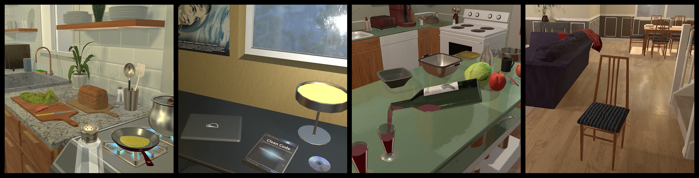

# 🤖 RL-THOR

RL-THOR is a lightweight and widely customizable reinforcement learning environment based on [AI2-THOR](https://ai2thor.allenai.org/) environment simulation. It provides a rich set of predefined tasks and allows users to create custom tasks and presets for the environment, designed for embodied meta reinforcement learning. The environment supports various continuous and discrete action spaces, and provides various observation modalities such as 1st or 3rd person RGB images, depth maps, and instance segmentation masks **[not supported yet, check if we keep this]**. It also supports multi-task learning and integrates seamlessly with popular RL algorithms implementations like [Stable Baselines3](https://github.com/DLR-RM/stable-baselines3).

AI2-THOR is a photorealistic interactive 3D environment for training AI agents to understand the world in the same way humans do. It is designed to be a general-purpose environment for training AI agents, and it is widely used by the research community. This project aims at providing a simple and efficient way to use AI2-THOR for reinforcement learning research.

<p align="center">
  
</p>

-> **[Chose images that illustrate the different tasks and key characteristics of the environment/benchmark better]**

-> **[Continue with more details]**

-> **[Add gif of agent training]**

## Contents <!-- omit from toc -->

- [💻 Installation](#-installation)
  - [Requirements](#requirements)
- [🏃 Getting Started](#-getting-started)
- [☁️ Running Headless](#️-running-headless)
  - [Cloud rendering](#cloud-rendering)
  - [Starting X-Server](#starting-x-server)
- [✏️ Environment Configuration](#️-environment-configuration)
  - [🕹️ Task Configuration](#️-task-configuration)
- [➕ Creating new tasks - \[WIP\]](#-creating-new-tasks---wip)
- [🧮 The Benchmark](#-the-benchmark)
  - [Reproducing baselines results](#reproducing-baselines-results)
- [📔 Citation](#-citation)
- [🧾 License](#-license)
- [🤝 Contributing](#-contributing)

**[Add features section?]**
**[Clearer separation between environment and benchmark?]**

## 💻 Installation

1. **Create virtual environment**\
    We recommend you use a [conda](https://docs.conda.io/projects/conda/en/latest/user-guide/install/) virtual environment:

    ```bash
      #  We require python>=3.12
      conda create -n rl_thor python=3.12
      conda activate rl_thor
    ```

2. **Install RL-THOR and its dependencies**\
    To install and customize the environment locally:

    ```bash
    git clone https://github.com/Kajiih/rl_thor.git
    pip install -r requirements/dev.txt
    ```

    **[!! Not supported yet !!]**
    Alternatively, if you only want to use predefined settings and task, you can install the PyPI package:

    ```bash
    pip install rl-thor
    ```

### Requirements

RL-THOR requires Python 3.12 or later. In addition, it shares the same requirements as AI2-THOR. Notably, Windows systems are not natively supported. For detailed requirements, refer to the [AI2-THOR requirements](https://github.com/allenai/ai2thor/?tab=readme-ov-file#requirements).

<!-- Test and add this as a solution for windows ?
https://yizhouzhao.medium.com/how-to-use-ai2thor-in-windows-f889abd7efcf -->

## 🏃 Getting Started

RL-THOR uses [Gymnasium](https://github.com/Farama-Foundation/Gymnasium) API, so you can use it as simply as any other Gym/Gymnasium environment.

This short script runs an ITHOR environment with the basic configuration and random actions:

```python
from rl_thor.envs import ITHOREnv

env = ITHOREnv()
obs, info = env.reset()

terminated, truncated = False, False
while not terminated and not truncated:
    action = env.action_space.sample()
    obs, reward, terminated, truncated, info = env.step(action)
env.close()
```

Note that the first time that you instantiate the environment, AI2-THOR will download locally the 3D simulator resources to `~/.ai2thor` (~500MB).

More examples and training scripts can be found in the `examples` folder of this repository.

To go further, we recommend you to get familiar with the [concepts of the ITHOR simulation environment](https://ai2thor.allenai.org/ithor/documentation/concepts) and [our documentation](https://github.com/Kajiih/rl_thor) **[create actual documentation]** to understand how tasks are defined.

## ☁️ Running Headless

By default AI2-THOR opens up a Unity window each time a Controller is instantiated, but there are several ways to run AI2-THOR in headless mode, which is useful for training agents on a remote server or in a cloud environment. Depending on your needs, you can use one of the following methods:

### Cloud rendering

AI2-THOR supports cloud rendering. You can enable it by setting the `platform` parameter under `controller_parameters` in the configuration file to `CloudRendering`:

```yaml
controller_parameters:
  platform: CloudRendering
```

Note that you will need the appropriate Vulkan drivers installed on your machine to use cloud rendering.

You can refer to the [official AI2-THOR documentation](https://ai2thor.allenai.org/ithor/documentation/#headless-setup) for more direct information.

### Starting X-Server

If you are using NVIDIA GPUs, an alternative solution is to start an X-Server on your machine. You can use the [script](https://github.com/allenai/ai2thor/blob/main/scripts/ai2thor-xorg) provided by AI2-THOR after installing the package in your environment:

```bash
ai2thor-xorg start
```

You should now be able to instantiate the AI2-THOR controllers.

If you prefer using docker, we have a [Dockerfile](docker/Dockerfile) based on [ai2thor-docker](https://github.com/allenai/ai2thor-docker) repository.

Build the image:

```bash
./docker/scripts/build.sh
```

Run the image:

```bash
./docker/scripts/run.sh
```

In the container, you can instantiate the controller, for example, run the test script:

```bash
python example_agent.py
```

## ✏️ Environment Configuration

The environment can be configured through a `yaml` file or by dictionary when instantiating the environment.

For a complete enumeration of the configuration options, see [Configuration](https://github.com/Kajiih/rl_thor). **[create actual documentation]**

If unspecified, the environment configuration is equivalent to the file `configurations/environment_config.yaml` of this repository.

```yaml
# === General ===
seed: 1
max_episode_steps: 1000

# === Simulator ===
controller_parameters:
  platform: null # set to "CloudRendering" for headless cloud rendering
  visibility_distance: 1.5
  # Camera properties
  frame_width: 300
  frame_height: 300
  field_of_view: 90

scene_randomization:
  random_agent_spawn: False # If True, the agent will spawn at a random location and rotation at the beginning of each episode
  random_object_spawn: False # If True, pickupable objects will spawn at random locations at the beginning of each episode
  random_object_materials: False # If True, the materials of the objects will be randomized at the beginning of each episode
  random_object_colors: False # If True, the colors of the objects will be randomized at the beginning of each episode  # Note: Not realistic
  random_lighting: False # If True, the lighting conditions will be randomized at the beginning of each episode

# === Actions ===
action_groups:
  # === Navigation actions ===
  movement_actions: True
  rotation_actions: True
  head_movement_actions: True
  crouch_actions: False
  # === Object manipulation actions ===
  pickup_put_actions: True
  drop_actions: False
  throw_actions: False
  push_pull_actions: False
  hand_control_actions: False
  # === Object interaction actions ===
  open_close_actions: True
  toggle_actions: True
  slice_actions: False
  use_up_actions: False
  liquid_manipulation_actions: False
  break_actions: False

action_modifiers:
  discrete_actions: True # If True, all actions requiring a parameter will be discretized and use their discrete value
  target_closest_object: True # If True, the closest operable object to the agent will be used as target for object interaction actions (e.g. pickup, open, etc.)
  simple_movement_actions: False # Only keep MoveAhead action (no MoveBack, MoveRight and MoveLeft Actions), should at least be used with body_rotation_actions
  static_pickup: False # Picked up objects don't teleport to hand
  stationary_placement: True # If False, a placed object will use the physics engine to resolve the final position (no deterministic placement)
  partial_openness: False # If True, objects can be opened partially with a parameter (only if open_close_actions is already enabled and environment is continuous) -> Adds partial_open_object_action from the "special" action category and removes open_object_action and close_object_action

action_discrete_param_values: # If run in discrete mode
  movement_magnitude: 0.25
  rotation_degrees: 45
  head_movement_degrees: 30
  throw_strength: 50
  push_pull_strength: 100

# === Tasks ===
tasks:
  globally_excluded_scenes: [] # List of scene names to exclude for all tasks(only full names like "FloorPlan1", "FloorPlan201", ...)
  task_blueprints: []
```

When instantiating the environment, you can set the relative path to the configuration:

```python
env = gym.make("rl_thor/ITHOREnv-v0.1", config_path="path/to/config.yaml")
```

By default, this path is set to `config/environment_config.yaml`.

For convenience, you can also override specific values of the configuration with the `config_override` parameter.

**Example:**
If you only want to change the maximum number of steps per episode to 200 and
the randomization of the Agent's spawn location and object materials, you can do it like this:

```python
config_override = {
    "max_episode_steps": 200,
    "scene_randomization": {
        "random_agent_spawn": True,
        "random_object_materials": True,
    },
}
env = gym.make(
    "rl_thor/ITHOREnv-v0.1",
    config_folder_path="config/environment_config.yaml",  # Default value
    config_override=config_override,
)
```

### 🕹️ Task Configuration

**[Add more details about the task configuration]**

## ➕ Creating new tasks - [WIP]

In AI2-THOR RL, we use a specific task description format called [Graph Task](https://github.com/Kajiih/rl_thor) **[link to documentation]**.

Thanks to graph tasks, you can define a new task by describing its agency list. In practice, it is as simple as creating a python dictionary describing the task items, their properties and their relations:

```python
task_description_dict = {
    "plate_receptacle": {
        "properties": {"objectType": "Plate"},
    },
    "hot_apple": {
        "properties": {"objectType": "Apple", "temperature": "Hot"},
        "relations": {"plate_receptacle": ["contained_in"]},
    },
}
```

This code lets you define a new task consisting of putting a hot apple in a plate. `hot_apple` and `plate_receptacle` are identifiers of the items used to defined relations and each property and relation can be found [here](.) **[link to documentation]**. This is enough to automatically create the reward function associated to the graph task.

-> **[Add explanation how to define task blueprints in the configuration]**

-> **[If automatic task creation from dict is not implemented, also add how to create the class corresponding to the task]**

For more details about how to define new tasks, item properties or relations, see the [dedicated part of the documentation](.) **[create actual documentation]**.

## 🧮 The Benchmark

### Reproducing baselines results

Not available yet

## 📔 Citation

Not available yet

## 🧾 License

| Component            | License                                                                  |
| -------------------- | -------------------------------------------------------------------------|
| Codebase (this repo) | [MIT License](LICENSE)                                                   |
| AI2-THOR             | [Apache License Version 2.0](https://www.apache.org/licenses/LICENSE-2.0)|

## 🤝 Contributing

Not available yet
